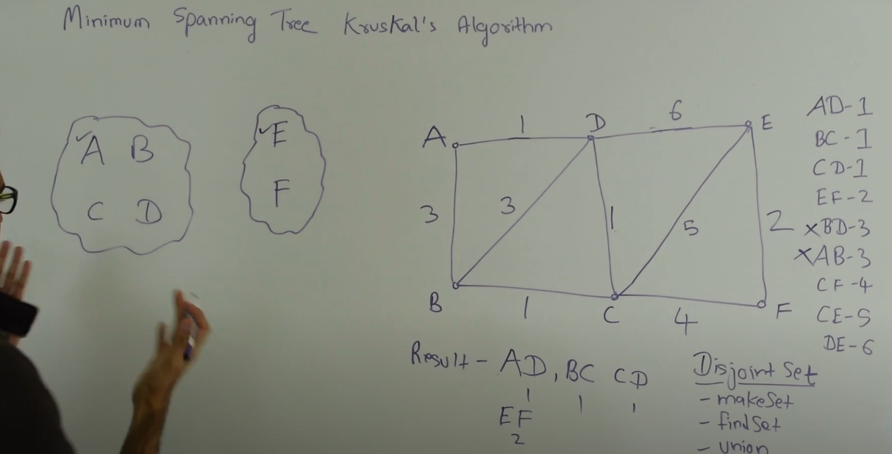

# Trees

## DFS 

**Time Complexity:** `O(n)`    
**Space Complexity:**    
                    - Best case: `O(log(n))` because max height of a tree is *log(n)*    
                    - Worst case: `O(n)`   


### Iterative Method using Stack

```python
class TreeNode:
    def __init__(self, x):
        self.val = x
        self.left = None
        self.right = None

# Pre-order (root, left, right)
def dfs_preorder(root):
    if root is None:
        return []
    stack, result = [root], []
    while stack:
        node = stack.pop()
        result.append(node.val)
        if node.right:
            stack.append(node.right)
        if node.left:
            stack.append(node.left)
    return result


# In-order (left, root, right)
# Change the traversal order to visit the left child first, then the root, and then the right child.
def dfs_inorder(root):
    if root is None:
        return []
    stack, result = [], []
    current = root
    while stack or current:
        while current:
            stack.append(current)
            current = current.left
        current = stack.pop()
        result.append(current.val)
        current = current.right
    return result

# Post-order (left, right, root)
# Modify the final result list by reversing it to get the correct post-order traversal.
def dfs_postorder(root):
    if root is None:
        return []
    stack, result = [root], []
    while stack:
        node = stack.pop()
        result.append(node.val)
        if node.left:
            stack.append(node.left)
        if node.right:
            stack.append(node.right)
    return result[::-1]
```


### Recursive Method

```python
class TreeNode:
    def __init__(self, val):
        self.val = val
        self.left = None
        self.right = None

# Pre-order (root, left, right)
def preorder(root):
    result = []
    def helper(node):
        if not node:
            return
        result.append(node.val)
        helper(node.left)
        helper(node.right)
    helper(root)
    return result

# In-order (left, root, right)
def inorder(root):
    result = []
    def helper(node):
        if not node:
            return
        helper(node.left)
        result.append(node.val)
        helper(node.right)
    helper(root)
    return result

# Post-order (left, right, root)
def postorder(root):
    result = []
    def helper(node):
        if not node:
            return
        helper(node.left)
        helper(node.right)
        result.append(node.val)
    helper(root)
    return result

# Example usage
root = TreeNode(1)
root.left = TreeNode(2)
root.right = TreeNode(3)
root.left.left = TreeNode(4)
root.left.right = TreeNode(5)

print("Pre-order:", preorder(root))
print("In-order:", inorder(root))
print("Post-order:", postorder(root))

```


## BFS


- **Time Complexity:** `O(n)`
- **Space Complexity:**
  - **Best case:** `O(log(n))` for a balanced binary tree
  - **Worst case:** `O(n)` for a completely unbalanced tree


```python
from collections import deque

class TreeNode:
    def __init__(self, value):
        self.value = value
        self.left = None
        self.right = None

def bfs(root):
    if not root:
        return []

    queue = deque([root])
    result = []

    while queue:
        current = queue.popleft()
        result.append(current.value)
        
        if current.left:
            queue.append(current.left)
        if current.right:
            queue.append(current.right)
    
    return result

# Example Usage
# Creating a sample tree:
#         1
#        / \
#       2   3
#      / \   \
#     4   5   6

root = TreeNode(1)
root.left = TreeNode(2)
root.right = TreeNode(3)
root.left.left = TreeNode(4)
root.left.right = TreeNode(5)
root.right.right = TreeNode(6)

print(bfs(root))  # Output: [1, 2, 3, 4, 5, 6]
```

# Minimum Spanning Tree (MST)

## Kruskal Algorithm

**“Sorting + Union-Find”**

1. **Sort all edges by weight**: Start by sorting all the edges in the graph in increasing order of their weight.
2. **Select edges in order**: Begin with the smallest edge and keep adding edges in ascending order of weight.
3. **Use disjoint sets to track connectivity**: Maintain a disjoint set (or Union-Find data structure) to group vertices. For each edge, check if its two vertices belong to the same set:
    - If they do, skip the edge to avoid creating a cycle.
    - If they don’t, merge the sets of the two vertices and include the edge in the MST.
4. **Repeat until all vertices are connected**: Continue this process until all vertices are part of a single set, resulting in the Minimum Spanning Tree (MST).

**Key Points:**

- The algorithm ensures no cycles are formed by using disjoint sets.
- It builds the MST by greedily selecting the smallest available edge that connects two disjoint sets.



```python
class DisjointSet:
    def __init__(self, n):
        # Each element is parent of itself to form an individual disjoint set.
        self.parent = list(range(n)) # [0,1,2,3,...]
        self.rank = [0] * n

    def find(self, u):
        # If a set is not parent of itself, then use path compression
        # to find the root(topmost parent) of the disjoint set.
        ## Gets into work when you have started to form new disjoint sets and 
        ## other individual sets have joined you already.
        if self.parent[u] != u:
            self.parent[u] = self.find(self.parent[u])
        return self.parent[u]

    def union(self, u, v):
        # Union by rank to attach smaller tree under the larger tree
        root_u = self.find(u)
        root_v = self.find(v)
        if root_u != root_v:
            if self.rank[root_u] > self.rank[root_v]:
                self.parent[root_v] = root_u
            elif self.rank[root_u] < self.rank[root_v]:
                self.parent[root_u] = root_v
            else:
                self.parent[root_v] = root_u
                self.rank[root_u] += 1

def kruskal(graph, n):
    # Sort edges by weight in ascending order
    edges = sorted(graph, key=lambda edge: edge[2])
    disjoint_set = DisjointSet(n)
    mst = []  # Minimum Spanning Tree
    total_weight = 0

    for u, v, weight in edges:
        # Check if the current edge forms a cycle
        if disjoint_set.find(u) != disjoint_set.find(v):
            # If not, add the edge to the MST
            disjoint_set.union(u, v)
            mst.append((u, v, weight))
            total_weight += weight

    return mst, total_weight

# Example usage:
# Graph represented as a list of edges (u, v, weight)
graph = [
    (0, 1, 2), (0, 3, 6),
    (1, 2, 3), (1, 3, 8), (1, 4, 5),
    (2, 4, 7),
    (3, 4, 9)
]
n = 5  # Number of vertices

# Find the Minimum Spanning Tree using Kruskal's Algorithm
mst, total_weight = kruskal(graph, n)
print("Edges in the Minimum Spanning Tree:", mst)
print(f"Total weight of the Minimum Spanning Tree: {total_weight}")

```

Understand the code here: 

[Tushar Roy - Kruskal's Algorithm](https://www.youtube.com/watch?v=fAuF0EuZVCk)     
[Tushar Roy - Disjoin Sets](https://www.youtube.com/watch?v=ID00PMy0-vE)      
[Abdul Bari - In-depth Disjoint Set](https://www.youtube.com/watch?v=wU6udHRIkcc)     


## Prim’s Algorithm

**"Greedy + Heap + Visited"**

- **Greedy**: Always picks the smallest edge available at each step.
- **Heap**: Uses a min-heap (priority queue) to efficiently find the smallest edge.
- **Visited**: Tracks visited nodes to avoid cycles and ensure the tree grows correctly.

---

1. **Start with a single vertex**: Begin from any vertex (e.g., vertex 0) and mark it as part of the MST.
2. **Use a min-heap to track edges**: Maintain a min-heap (priority queue) to store edges connected to the current MST. Each edge is represented as `(weight, vertex)`.
3. **Grow the MST greedily**:
    - Extract the smallest edge from the heap.
    - If the connected vertex is unvisited, add it to the MST and mark it as visited.
    - Add all its unvisited neighbors to the heap with their respective edge weights.
4. **Repeat until all vertices are included**: Continue this process until all vertices are part of the MST, ensuring no cycles are formed.

---

**Key Points:**

- The algorithm builds the MST one vertex at a time, always choosing the smallest available edge connected to the current MST.
- It uses a **min-heap** to efficiently find the smallest edge and a **visited array** to avoid cycles.

---

```python
from collections import heapq

def prim(graph):
    # Start from the node 0
    start = 0
    visited = [False] * len(graph)
    heap = [(0, start)] # (wt, vertex)
    parent = [-1] * len(graph)  # Array to store the MST edges
    total_wt = 0 
    
    while heap:
        wt, u = heapq.heappop(heap)
        
        # If the node is already visited, skip it
        if visited[u]:
            continue
            
        # Mark the current node as visited
        visited[u] = True
        total_wt += wt  # Add weight to the total weight
        
        # Explore neighbors
        for v, w in graph[u]:
            if not visited[v]:
                heapq.heappush(heap, (w, v))
                parent[v] = u  # Set parent of v to u

    # Print the MST
    print("Minimum Spanning Tree edges:")
    for i in range(1, len(graph)):
        if parent[i] != -1:
            print(f"({parent[i]}, {i})")
    
    # Print the total weight
    print(f"Total weight of the Minimum Spanning Tree: {total_wt}")

# Example usage:
# Graph represented as an adjacency list (node: [(neighbor, weight), ...])
graph = [
    [(1, 2), (3, 6)],
    [(0, 2), (2, 3), (3, 8), (4, 5)],
    [(1, 3), (4, 7)],
    [(0, 6), (1, 8)],
    [(1, 5), (2, 7)]
]

prim(graph)
```