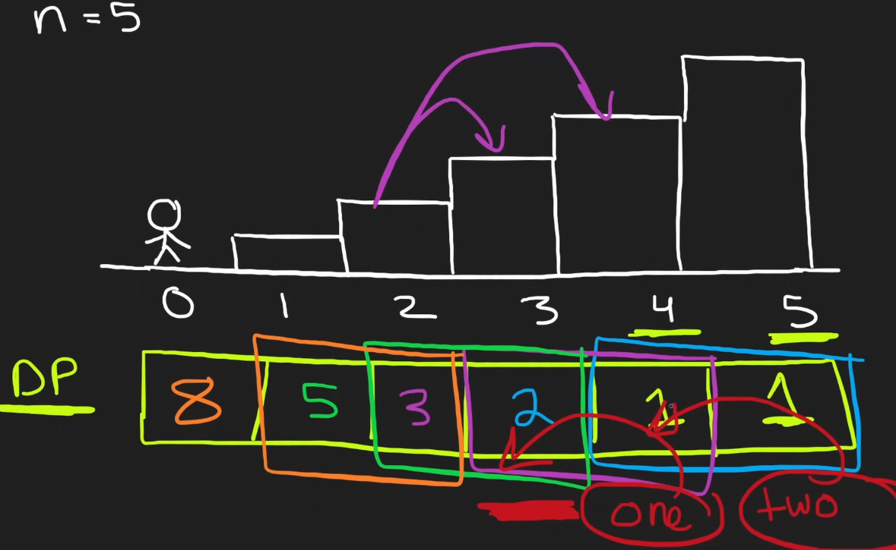
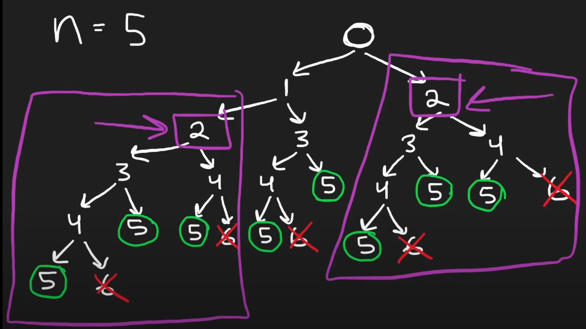

# 70. Climbing Stairs

## Type 1 solution
```python
class Solution:
    def climbStairs(self, n: int) -> int:
        # If there are 1 or 2 steps, the number of ways to climb them is the same as the number of steps.
        if n <= 2:
            return n
        
        # Initialize base cases for the first two steps.
        prev, curr = 1, 2
        
        # Use a loop to calculate the number of ways to climb up to the nth step.
        for _ in range(3, n + 1):
            # Update the number of ways for the current step.
            prev, curr = curr, prev + curr
        
        # Return the total number of ways to reach the nth step.
        return curr

# Example usage:
# The number of ways to climb 5 steps is 8.
solution = Solution()
print(solution.climbStairs(5))  # Output: 8
```
### Explanation
The problem is to find the number of distinct ways to climb a staircase of `n` steps, where each time you can either climb 1 step or 2 steps. This problem can be solved using dynamic programming, where each step's value is derived from the sum of the ways to climb the previous step and the step before that (similar to the Fibonacci sequence).

### Complexity
- **Time Complexity:** O(n), where `n` is the number of steps. We iterate through each step once.
- **Space Complexity:** O(1), as we only use a constant amount of extra space for variables `prev` and `curr`.

## Type 2 solution

```python
def climbStairs(n):
      one, two = 1,1
      for i in range(n-1):
          one, two = one+two, one
      return one
```




---


## DFS with Memoization Solution
In this approach, we use DFS to explore each possible path to climb the stairs, and we use memoization to store already computed results, which avoids redundant calculations.

```python
class Solution:
    def __init__(self):
        self.memo = {}

    def climbStairs(self, n: int) -> int:
        # Base cases: if n is 1 or 2, return n directly.
        if n <= 2:
            return n
        
        # If the result for this n is already computed, return it from the memo.
        if n in self.memo:
            return self.memo[n]
        
        # Recursively compute the number of ways for n-1 and n-2.
        self.memo[n] = self.climbStairs(n - 1) + self.climbStairs(n - 2)
        
        return self.memo[n]

# Example usage:
# The number of ways to climb 5 steps is 8.
solution = Solution()
print(solution.climbStairs(5))  # Output: 8
```


### Explanation
1. **Depth-First Search (DFS):** DFS explores each possible step, recursively breaking down the problem into subproblems of smaller steps.
2. **Memoization:** We use a dictionary (`self.memo`) to store the results of previously computed steps to avoid redundant calculations. This caching of results ensures that we do not compute the same values multiple times, which optimizes the solution.

### Complexity
- **Time Complexity:** O(n), as we compute each step only once and store the result in the memo.
- **Space Complexity:** O(n), due to the space used by the memo dictionary to store the results.


---


## Differences Between the `Type 1` and `Type 2` Approaches

Absolutely, let's dive into the core difference between the approach and logic of these two solutions. While they both solve the "Climbing Stairs" problem efficiently, they conceptualize and implement the solution differently.

---

### **First Solution: Dynamic Programming with Explicit Step Tracking**

```python
class Solution:
    def climbStairs(self, n: int) -> int:
        if n <= 2:
            return n
        prev, curr = 1, 2
        for _ in range(3, n + 1):
            prev, curr = curr, prev + curr
        return curr
```

**Approach and Logic:**

- **Dynamic Programming (Bottom-Up):** This solution uses a bottom-up dynamic programming approach. It builds the solution by starting from the base cases and incrementally solving for larger `n`.

- **Explicit Step Representation:**
  - **`prev` and `curr`:** These variables represent the number of ways to reach the previous step (`n-1`) and the current step (`n`), respectively.
  - **Physical Analogy:** Imagine standing on step `n`, you can get there from either step `n-1` (taking one step) or step `n-2` (taking two steps). So, the total ways to reach step `n` is the sum of ways to reach those two steps.

- **Iteration Over Steps:**
  - The loop starts from step **3** because steps **1** and **2** are base cases.
  - For each step, it updates `prev` and `curr` to reflect the new state.

- **Core Insight:**
  - The problem is approached as a **state transition**, where each state (step) depends on the previous states. It's a direct application of the dynamic programming principle.

---

### **Second Solution: Fibonacci Sequence Simplification**

```python
class Solution:
    def climbStairs(self, n: int) -> int:
        one, two = 1, 1
        for _ in range(n - 1):
            one, two = one + two, one
        return one
```

**Why the Loop Runs `n - 1` Times:**

- **Starting Point:** We already know the number of ways to reach **Step 1** (which is 1).
- **Goal:** We need to calculate the number of ways to reach up to **Step n**.
- **Calculations Needed:** We need to compute the ways for steps **2** through **n**, which is a total of `n - 1` steps.
  


**Approach and Logic:**

- **Mathematical Sequence (Fibonacci):**
  - This solution recognizes that the number of ways to climb the stairs follows the Fibonacci sequence.
  - Instead of explicitly mapping to steps, it focuses on generating the sequence.

- **Variables as Sequence Elements:**
  - **`one` and `two`:** Represent the last two numbers in the sequence, not necessarily tied to specific steps.
  - They are initialized to **1** because the first two numbers in the Fibonacci sequence are **1** and **1**.

- **Iteration Over Sequence Length:**
  - The loop runs **`n - 1` times**, effectively building up the sequence until it reaches the nth number.
  - In each iteration, it updates `one` and `two` to the next numbers in the sequence.

- **Core Insight:**
  - The problem is reframed as generating the **nth Fibonacci number**, leveraging the mathematical properties of the sequence.
  - It's a more abstract approach, focusing on numerical patterns rather than the physical act of climbing stairs.

---

### **Key Differences in Approach and Logic**

1. **Problem Framing:**

   - **First Solution:** Frames the problem in terms of climbing stairs, with each step representing a state influenced by previous steps.
   - **Second Solution:** Frames the problem as finding the nth number in the Fibonacci sequence.

2. **Variable Interpretation:**

   - **First Solution:**
     - **`prev` and `curr`** are directly associated with the number of ways to reach specific steps.
   - **Second Solution:**
     - **`one` and `two`** are abstract sequence values without a direct connection to steps.

3. **Initial Conditions:**

   - **First Solution:**
     - Starts with **`prev = 1`** (1 way to climb 1 step) and **`curr = 2`** (2 ways to climb 2 steps).
   - **Second Solution:**
     - Both variables start as **1**, matching the starting point of the Fibonacci sequence.

4. **Iteration Mechanics:**

   - **First Solution:**
     - The loop runs from step **3** to **`n`**, aligning with actual steps on the staircase.
   - **Second Solution:**
     - The loop runs **`n - 1`** times, focusing solely on sequence progression.

---

### **Implications of the Different Approaches**

- **First Solution - Dynamic Programming Perspective:**

  - **Intuitive for Step-Based Problems:**
    - This method is beneficial when the problem naturally fits into a state-based dynamic programming model.
  - **Clear Mapping to Physical Scenario:**
    - By representing variables as steps, it helps in understanding and visualizing the problem.

- **Second Solution - Mathematical Perspective:**

  - **Efficient for Sequence Generation:**
    - It abstracts the problem, allowing for a concise solution by leveraging known mathematical sequences.
  - **Flexibility for Similar Problems:**
    - This approach can be adapted to any problem that can be modeled using the Fibonacci sequence or similar recurrence relations.

---

### **Which Approach to Use When**

- **Use the First Approach If:**

  - You prefer to **think in terms of the actual problem context**, especially when the problem involves sequential steps or stages.
  - You want to **track specific states** and have a clear understanding of how each state relates to the problem.

- **Use the Second Approach If:**

  - You're comfortable with **mathematical abstractions** and recognize that the problem aligns with a known sequence.
  - You aim for a **more generalized solution** that can be applied to other problems with similar mathematical properties.

---

### **Applying This Understanding**

Since you enjoy learning through practical examples and value readability and optimization in code, here's how you might apply this:

- **When Solving Similar Problems:**

  - **Identify the Nature of the Problem:**
    - Determine if the problem is more state-driven (like steps) or sequence-driven (like Fibonacci).
  - **Choose the Approach That Aligns:**
    - For step-driven problems, lean towards dynamic programming with explicit state tracking.
    - For sequence-driven problems, consider mathematical abstractions.

- **For Coding Interviews:**

  - **Demonstrate Flexibility:**
    - Show that you can approach a problem from multiple angles.
  - **Explain Your Thought Process:**
    - Articulate why you're choosing a particular approach, reflecting your depth of understanding.

---

### **Key Takeaways**

- **First Solution:**
  - *Approach:* Dynamic programming with explicit step tracking.
  - *Logic:* Number of ways to reach a step equals the sum of ways to reach the two previous steps.
  - *When to Use:* When the problem is naturally modeled as progressing through states or stages.

- **Second Solution:**
  - *Approach:* Mathematical sequence generation (Fibonacci).
  - *Logic:* The problem reduces to finding the nth number in a known sequence.
  - *When to Use:* When the problem aligns with a mathematical pattern or recurrence relation.
