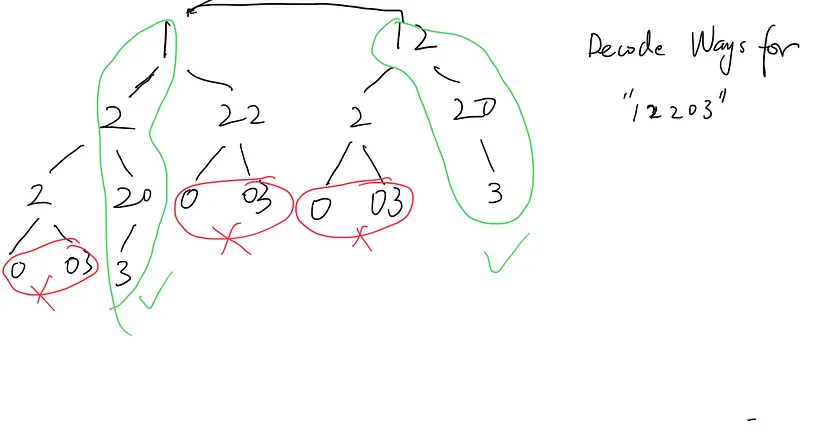

# 91. Decode Ways

## **1. Brute Force Approach**

**Idea:**

We can think of this problem as exploring all possible **ways** to partition the string into valid codes. At each position, we have up to two choices:

- Decode a single digit (if it's not '0').
- Decode two digits (if they form a number between 10 and 26).

We'll use recursion to try out every possible path.

**REMEMBER:** We are exploring the **ways** to form valid codes.    
                    Basically, how many ways we can select single or double digits such that they meet the provided conditions.


At each call, we're exploring both single and double-digit decoding options when valid.



**Code:**

```python
def num_decodings_brute_force(s):
    def decode(i):
        if i == len(s):
            return 1  # Reached the end successfully
        if s[i] == '0':
            return 0  # '0' cannot be decoded

        # Decode single digit
        count = decode(i + 1)

        # Decode two digits if valid
        if (i + 1 < len(s)) and (10 <= int(s[i:i+2]) <= 26):
            count += decode(i + 2)

        return count

    return decode(0)
```

**Complexity:**

- **Time Complexity:** O(2<sup>n</sup>), where *n* is the length of the string. In the worst case, each position leads to two recursive calls.
- **Space Complexity:** O(n), due to the recursion stack depth.


---

## **2. Brute Force with Memoization (Caching)**

**Idea:**

We notice that we're recalculating the same subproblems multiple times. To optimize, we'll store the results of subproblems in a cache (dictionary) to avoid redundant computations.

**Code:**

```python
def num_decodings_memo(s):
    cache = {}

    def decode(i):
        if i in cache:
            return cache[i]
        if i == len(s):
            return 1
        if s[i] == '0':
            return 0

        count = decode(i + 1)
        if (i + 1 < len(s)) and (10 <= int(s[i:i+2]) <= 26):
            count += decode(i + 2)

        cache[i] = count
        return count

    return decode(0)
```

**Complexity:**

- **Time Complexity:** O(n), since each subproblem is solved only once.
- **Space Complexity:** O(n), for the cache and recursion stack.

**Explanation:**

By storing results in `cache`, we ensure that each unique `index` is computed once. This transforms the exponential time complexity into linear.

---

## **3. Dynamic Programming Solution**

**Idea:**

We can further optimize by using an iterative approach, eliminating the recursion overhead. We'll create a DP array where `dp[i]` represents the number of ways to decode the substring `s[:i]`.

```ini
dp[i] = dp[i-1] + dp[i-2] (if 0 < s[i-1] + s[i] ≤ 26)
```

Counter Example:

```
Input: s = "301"
Output: 0
Explanation: "301" can be split as [[3],[01]] and [30] in the first iteration. 
              However, apart from `[3]` all the other branches cannot be further decoded.
              Even on decoding `[3]` further: `[3]`: `[[0], [01]]` ; both branches are invalid.
```

**AGAIN REMEMBER:** We are exploring the **ways** to form valid codes.    
                    Basically, how many ways we can select single or double digits such that they meet the provided conditions.

```ini
Code: 226

    : [] Empty string has 1 way to exist
A. 2: [2] (`[]` is exetended using new number)
B. 22: [[2,2],[22]] ([2] is extended from `A` to form [2,2], 
        then [22] is formed by extending `[]`)
C. 226: [[2,2,6],[22,6]] (extending on [2] from B) -> 2 ways using B
        [2,26] is also possible. Two digits are extended from `A`.
```

We extend the single digit from s[i-1] position and extend double digits from s[i-2] position.


**Code:**

```python
def num_decodings_dp(s):
    if not s or s[0] == '0':
        return 0

    n = len(s)
    dp = [0] * (n + 1)  # dp[i] is the ways to decode up to s[i-1]
    dp[0] = 1  # Empty string has 1 way
    dp[1] = 1  # Single character (not '0') has 1 way

    for i in range(2, n + 1):
        # Single-digit decode (if not '0')
        if s[i - 1] != '0':
            dp[i] += dp[i - 1]

        # Two-digit decode (if valid 10-26)
        two_digit = int(s[i - 2:i])
        if 10 <= two_digit <= 26:
            dp[i] += dp[i - 2]

    return dp[n]
```

**Complexity:**

- **Time Complexity:** O(n), we iterate through the string once.
- **Space Complexity:** O(n), for the DP array.

**Explanation with Example:**

Let's walk through `s = "226"`:

- **Initialization:**

  - `dp = [1, 1, 0, 0]` (since `n = 3`)

- **Iteration i = 2:**

  - Single-digit (`s[1] = '2'`): `dp[2] += dp[1]` ⇒ `dp[2] = 1`
  - Two-digit (`s[0:2] = '22'`): `dp[2] += dp[0]` ⇒ `dp[2] = 2`

- **Iteration i = 3:**

  - Single-digit (`s[2] = '6'`): `dp[3] += dp[2]` ⇒ `dp[3] = 2`
  - Two-digit (`s[1:3] = '26'`): `dp[3] += dp[1]` ⇒ `dp[3] = 3`

- **Result:**

  - `dp = [1, 1, 2, 3]`
  - `dp[3] = 3` ways to decode.

**Visualization:**

Constructing the DP table:

| Index (i) | s[0:i] | dp[i] | Explanation                             |
|-----------|--------|-------|-----------------------------------------|
| 0         | ""     | 1     | Empty string                            |
| 1         | "2"    | 1     | Single '2' maps to 'B'                  |
| 2         | "22"   | 2     | "2 2" ('B B'), "22" ('V')               |
| 3         | "226"  | 3     | "2 2 6" ('B B F'), "22 6" ('V F'), "2 26" ('B Z') |

---

## **Optimized Dynamic Programming (Space Efficient)**

We can reduce space to O(1) by only keeping track of the previous two values.

**Code:**

```python
def num_decodings_optimized_aligned(s):
    if not s or s[0] == '0':
        return 0
    
    n = len(s)
    prev = 1   # dp[0] (empty string)
    curr = 1   # dp[1], since s[0] is valid
    
    for i in range(2, n + 1):
        temp = 0
        # Single-digit decode (s[i - 1])
        if s[i - 1] != '0':
            temp += curr  # dp[i - 1]
        # Two-digit decode (s[i - 2:i])
        two_digits = int(s[i - 2:i])
        if 10 <= two_digits <= 26:
            temp += prev  # dp[i - 2]
        # Update prev and curr for next iteration
        prev, curr = curr, temp
    
    return curr
```

The same code can also be written as below. The loop starts from `1 to len(s)`.
Hence, the changes in index selections.     

```python
def num_decodings_dp_optimized(s):
    if not s or s[0] == '0':
        return 0

    prev, curr = 1, 1  # dp[-1], dp[0]
    for i in range(1, len(s)):
        temp = 0
        if s[i] != '0':
            temp = curr
        if 10 <= int(s[i-1:i+1]) <= 26:
            temp += prev
        prev, curr = curr, temp
    return curr
```

**Complexity:**

- **Time Complexity:** O(n)
- **Space Complexity:** O(1)

---

## **Summarized Complexities**

| Approach                   | Time Complexity | Space Complexity |
|----------------------------|-----------------|------------------|
| Brute Force                | O(2<sup>n</sup>)          | O(n)             |
| Brute Force with Memoization | O(n)          | O(n)             |
| Dynamic Programming        | O(n)            | O(n)             |
| DP with Space Optimization | O(n)            | O(1)             |


## DP Solution Intuition

[Intuition Behind 91. Decode Ways](https://medium.com/tech-life-fun/leet-code-91-decode-ways-graphical-explained-python3-solution-60d97a0852c8#:~:text=Best%20Solution%20(to,is%201)%20%3D%203.)

### **The Author's Explanation:**

> **"I can use Dynamic Programming to solve this. The idea comes from following thoughts: assuming there is a string X (for example, '12') and I know the ways to decode it is 2 (`[1,2]` or `[12]`). Now let me append one more char (for example, '3'). Obviously, for the new string, the decode way is 2 (by decode 3 to 'C' and get `[1,2,3]` or `[12,3]`) + 1 (by decode 3 with its previous char '2', and then use adopt the decode ways for '1' which is 1) = 3."**

---

### **Breaking Down the Explanation:**

#### **Step 1: Starting with a Known String '12'**

- **String:** `'12'`
- **Decoding Ways:**
  1. `[1, 2]` → `'1'` maps to 'A', `'2'` maps to 'B' ⇒ **'A B'**
  2. `[12]` → `'12'` maps to 'L' ⇒ **'L'**
- **Total Ways:** **2**

#### **Step 2: Appending One More Character '3' to Form '123'**

- **New String:** `'123'`

#### **Calculating New Decoding Ways:**

The author mentions **2 ways** from decoding `'3'` as a single digit and **1 additional way** from decoding `'23'` as a two-digit number, totaling **3 ways**.

Let's explore these in detail.

---

### **Exploring the 2 Ways by Decoding '3' as a Single Digit**

We extend the previous decoding ways of `'12'` by decoding the new character `'3'` as a single digit.

#### **Option 1: Extend `[1, 2]` with `'3'`**

- **Previous Decoding:** `[1, 2]` ⇒ 'A B'
- **New Digit:** `'3'` ⇒ 'C'
- **New Decoding:** `[1, 2, 3]` ⇒ 'A B C'

#### **Option 2: Extend `[12]` with `'3'`**

- **Previous Decoding:** `[12]` ⇒ 'L'
- **New Digit:** `'3'` ⇒ 'C'
- **New Decoding:** `[12, 3]` ⇒ 'L C'

**Total Ways from Decoding '3' as Single Digit:** **2**

---

### **Exploring the Additional Way by Decoding '23' as a Two-Digit Number**

Here, we consider decoding the last two characters `'2'` and `'3'` together as `'23'`.

#### **Option 3: Decode `'23'` as a Two-Digit Number**

- **Two-Digit Number:** `'23'` ⇒ 'W' (since 23 maps to 'W')
- **Remaining String:** `'1'`
  - **Decoding Ways for `'1'`:**
    - `[1]` ⇒ 'A'
    - **Total Ways for `'1'`**: **1**
- **Combine Decodings:**
  - **Previous Decoding of `'1'`:** `[1]` ⇒ 'A'
  - **Decoding of `'23'`:** 'W'
  - **New Decoding:** `[1, 23]` ⇒ 'A W'

**Additional Way from Decoding '23' as Two-Digit Number:** **1**

---

### **Summing It Up**

- **Ways by Decoding '3' as Single Digit:** **2**
- **Ways by Decoding '23' as Two-Digit Number:** **1**
- **Total Decoding Ways for '123':** **2 + 1 = 3**

---

### **Connecting to Dynamic Programming**

#### **Understanding dp[i]:**

- **dp[i]** represents the number of ways to decode the substring up to index **i**.

#### **Applying to Our Example:**

- **dp[0]:** Number of ways to decode an empty string ⇒ **1**
- **dp[1]:** Number of ways to decode `'1'` ⇒ **1**
- **dp[2]:** Number of ways to decode `'12'` ⇒ **2**
- **dp[3]:** Number of ways to decode `'123'` ⇒ Calculated based on dp[1] and dp[2]

#### **Calculating dp[3]:**

1. **If '3' Can Be a Single-Digit Decode:**

   - Since `'3'` ≠ `'0'`, it can be decoded as 'C'.
   - We can extend all decoding ways up to dp[2].
   - **Contribution:** dp[2] ⇒ **2**

2. **If '23' Can Be a Two-Digit Decode:**

   - Since `'23'` is between `'10'` and `'26'`, it can be decoded as 'W'.
   - We can extend all decoding ways up to dp[1].
   - **Contribution:** dp[1] ⇒ **1**

3. **Total dp[3]:**

   - **dp[3] = dp[2] (2) + dp[1] (1) = 3**

---

### **Why This Makes Sense**

- **Extending Previous Decodings:**

  - When decoding the last digit on its own, we're essentially appending to all the ways we could decode the string up to the previous character.

- **Considering the Two-Digit Decode:**

  - When the last two digits form a valid letter, we look at the ways we could decode the string **two positions back** and combine those decodings with the new letter.

- **Building Up Solutions:**

  - This approach of considering both the single-digit and two-digit possibilities at each step is the essence of dynamic programming: building larger solutions from smaller, already computed solutions.

---

### **Visual Representation**

Let's represent the decoding paths for `'123'`:

1. **Decoding Paths Through dp[2]:**

   - **Path A:** `[1, 2, 3]` ⇒ 'A B C' (dp[2] extended with '3' as single digit)
   - **Path B:** `[12, 3]` ⇒ 'L C' (dp[2] extended with '3' as single digit)

2. **Decoding Path Through dp[1]:**

   - **Path C:** `[1, 23]` ⇒ 'A W' (dp[1] extended with '23' as two-digit decode)

---

### **Key Takeaways**

- **Incremental Building:**

  - We can think of decoding a longer string by considering how new characters contribute to existing decoding ways.

- **Dynamic Programming Logic:**

  - **dp[i] = dp[i - 1] (if single-digit decode is valid)**
    - We can append the current character as a single-digit decode to all decoding ways up to `dp[i - 1]`.

  - **dp[i] += dp[i - 2] (if two-digit decode is valid)**
    - We can append the current two-digit number as a decode to all decoding ways up to `dp[i - 2]`.

- **Total Decoding Ways are the Sum of Both Possibilities:**

  - This ensures all valid decoding paths are accounted for.

---

### **Applying This Understanding to Code**

Here's how the code reflects this logic:

```python
def num_decodings(s):
    n = len(s)
    if n == 0 or s[0] == '0':
        return 0
    
    dp = [0] * (n + 1)
    dp[0] = 1  # Base case: empty string
    dp[1] = 1  # First character is valid (since s[0] != '0')
    
    for i in range(2, n + 1):
        # Check if single-digit decode is valid
        if s[i - 1] != '0':
            dp[i] += dp[i - 1]
        
        # Check if two-digit decode is valid
        two_digit = int(s[i - 2:i])
        if 10 <= two_digit <= 26:
            dp[i] += dp[i - 2]
    
    return dp[n]
```

- **dp[i] += dp[i - 1]:** Corresponds to decoding the current character as a single-digit number.
- **dp[i] += dp[i - 2]:** Corresponds to decoding the last two characters as a two-digit number.

---

### **Conclusion**

- **The Author's Insight:**

  - By considering how we can build upon existing decoding ways when appending a new character, we gain intuition into how dynamic programming efficiently solves the problem.

- **Understanding the Last Sentences:**

  - They illustrate that the total number of decoding ways for the new string `'123'` is the sum of:
    - **Ways of extending previous decodings with a single-digit decode.**
    - **Ways of combining earlier decodings with a two-digit decode.**
