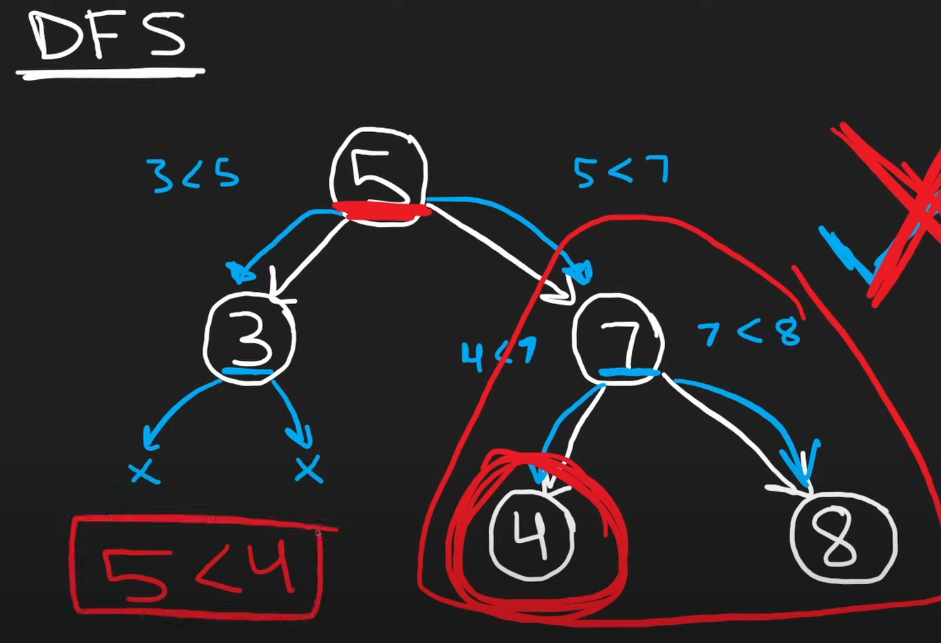

# 98. Validate Binary Search Tree


```python
class TreeNode:
    def __init__(self, val=0, left=None, right=None):
        self.val = val
        self.left = left
        self.right = right

def isValidBST(root: TreeNode) -> bool:
    def validate(node, low=-float('inf'), high=float('inf')):
        if not node:
            return True
        if not (low < node.val < high):
            return False
        return (validate(node.left, low, node.val) and
                validate(node.right, node.val, high))

    return validate(root)

# Example usage:
# Constructing a binary search tree (BST):
#      2
#     / \
#    1   3
tree = TreeNode(2)
tree.left = TreeNode(1)
tree.right = TreeNode(3)

print(isValidBST(tree))  # Output: True
```

 **Time & Space Complexity**:
   - **Time Complexity**: `O(n)`, where n is the number of nodes in the tree. Each node is visited exactly once.
   - **Space Complexity**: `O(h)`, where h is the height of the tree. This is the space taken up by the call stack during recursion. In a balanced tree, this would be `O(log n)`, and in the worst case (a completely unbalanced tree), it would be O(n).

### **Approach**:

#### **Why Propagate Ancestor Constraints?**
- **BST Rule:** Every node must respect its ancestors' values:
  - Left descendants must be **smaller** than all ancestors above.
  - Right descendants must be **larger** than all ancestors above.
- **Efficiency:** Instead of checking every ancestor for each node, propagate a **range `(low, high)`** that encodes all ancestor constraints.


#### **How It Works:**
1. **Left Child (`node.left`):**
   - **New Upper Bound:** `node.val`  
     *Why?* Left descendants must be smaller than the current node.
   - **Example:** If current node is `5`, left child must be **<5**.

2. **Right Child (`node.right`):**
   - **New Lower Bound:** `node.val`  
     *Why?* Right descendants must be larger than the current node.
   - **Example:** If current node is `5`, right child must be **>5**.




The example above illustrates that why the normal comparision does not work.  
In a BST, the children and thier descendants must satisfy the comparision with any ancestor node.   
Hence, we have to propogate the constraints from the ancestors too. 


[Neetcode Video Solution](https://www.youtube.com/watch?v=s6ATEkipzow)


---

### **Example Tree:**
```
        10
       /  \
      5    15
     / \   / \
    2   7 12 20
       /
      6
```

#### **Propagation in Action:**
1. **Root (`10`):**  
   Range: `(-∞, +∞)`  
   - Left child (`5`): Range becomes `(-∞, 10)`  
   - Right child (`15`): Range becomes `(10, +∞)`

2. **Node (`5`):**  
   Range: `(-∞, 10)`  
   - Left child (`2`): Range becomes `(-∞, 5)`  
   - Right child (`7`): Range becomes `(5, 10)`

3. **Node (`7`):**  
   Range: `(5, 10)`  
   - Left child (`6`): Range becomes `(5, 7)`  
     - Check: `5 < 6 < 7` → Valid.

4. **Node (`15`):**  
   Range: `(10, +∞)`  
   - Left child (`12`): Range becomes `(10, 15)`  
     - Check: `10 < 12 < 15` → Valid.  
   - Right child (`20`): Range becomes `(15, +∞)`  
     - Check: `15 < 20 < +∞` → Valid.


