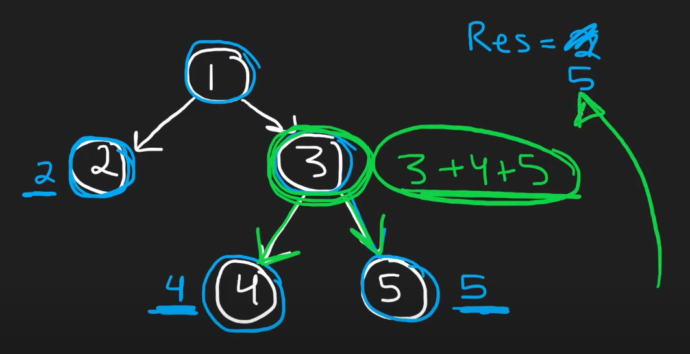

# 124. Binary Tree Maximum Path Sum

```python
class TreeNode:
    def __init__(self, val=0, left=None, right=None):
        self.val = val
        self.left = left
        self.right = right

def maxPathSum(self, root: Optional[TreeNode]) -> int:
    maxsum = float('-inf')
    
    def maxpath(root):
        nonlocal maxsum
        if not root:
            return 0
        
        # Calculate max path sum of left and right subtrees
        lsum = max(maxpath(root.left), 0)
        rsum = max(maxpath(root.right), 0)
        
        # Calculate current max path sum including the node itself
        currmax = root.val + lsum + rsum
        
        # Update the global maxsum, with root included
        maxsum = max(maxsum, currmax)
        
        # Return the maximum gain if the current node is treated as end node
        return root.val + max(lsum, rsum)
    
    maxpath(root)
    return maxsum

root = TreeNode(1)
root.left = TreeNode(2)
root.right = TreeNode(3)
root.left.left = TreeNode(4)
root.left.right = TreeNode(5)

print("Maximum Path Sum:", maxPathSum(root))  # Output: 15 (4->2->1->3->5)
```

### Explanation:

We must NOT return the sum of the paths from both left and right. Because,
a path cannot have both left and right. Rather, compare it with the max_sum 
because this could be the only isolated path along with root having maximum sum.



In the example below, we can take either root, root+left, or root+right. 
Or just `0`, if negative values are involved.


### Time & Space Complexity:
- **Time Complexity**: O(N), where N is the number of nodes in the tree. We visit each node exactly once.
- **Space Complexity**: O(H), where H is the height of the tree. This space is used for the recursion stack.


---

### Deep Dive

**1. Excluding Negative Paths:**

```python
lsum = max(maxpath(root.left), 0)
```
- **Why:** Including a negative path would reduce our total sum. Setting negative sums to `0` effectively **cuts off** that path.

**2. Updating `maxsum`:**

```python
maxsum = max(maxsum, current_max)
```
- **Why:** We need to keep track of the highest path sum found **at any point** in the tree. Since `current_max` includes both subtrees and the current node, it represents all possible paths passing through this node.

**3. Returning Max Gain Upwards:**

```python
return root.val + max(lsum, rsum)
```
- **Why:** When moving up the tree, we can only choose one path (left or right) to continue upwards. This reflects the nature of paths in a tree (they can't split upwards).


### 🔍 Visualization:

Let's visualize how this works with an example. Consider the following binary tree:

```
       1
      / \
     2   3
    / \
   4   5
```

**Step-by-Step Traversal:**

1. **Starting at Node 4:**
   - Left and right children are `None`, so `lsum = rsum = 0`.
   - `current_max = 4 + 0 + 0 = 4`.
   - Update `maxsum = max(-inf, 4) = 4`.
   - Return `4 + max(0, 0) = 4` to parent (Node 2).

2. **At Node 5:**
   - Similar to Node 4, returns `5` with `current_max = 5`.
   - Update `maxsum = max(4, 5) = 5`.

3. **At Node 2:**
   - `lsum = 4` (from Node 4), `rsum = 5` (from Node 5).
   - `current_max = 2 + 4 + 5 = 11`.
   - Update `maxsum = max(5, 11) = 11`.
   - Return `2 + max(4, 5) = 7` to parent (Node 1).

4. **At Node 3:**
   - Left and right are `None`.
   - Returns `3` with `current_max = 3`.
   - `maxsum` remains `11`.

5. **At Root Node 1:**
   - `lsum = 7` (from Node 2), `rsum = 3` (from Node 3).
   - `current_max = 1 + 7 + 3 = 11`.
   - `maxsum` remains `11`.
   - Return `1 + max(7, 3) = 8`.

**Result:** The maximum path sum is `11`, which corresponds to the path `4 -> 2 -> 5`.
