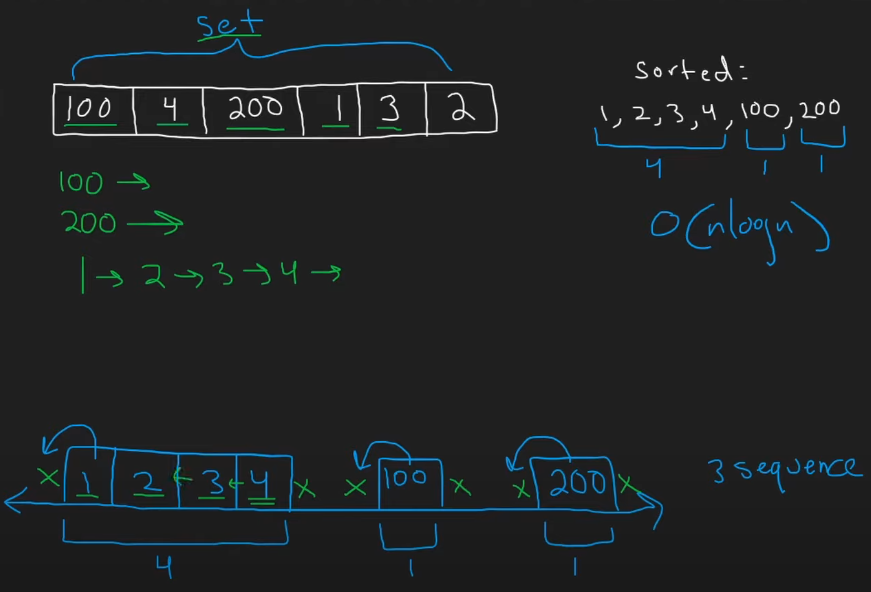

# 128. Longest Consecutive Sequence


```python
def longestConsecutive(nums):
    num_set = set(nums)  # Convert to set for O(1) lookups
    longest = 0

    for num in num_set:
        # Check if num is the start of a sequence
        if (num - 1) not in num_set:
            current_length = 1
            # Expand the sequence
            while (num + current_length) in num_set:
                current_length += 1
            # Update the longest sequence
            longest = max(longest, current_length)

    return longest
```

**Time Complexity:** `O(n)`    
**Space Complexity:** `O(n)`    


Why iterate through `num_set` instead of `nums`? Because the input may contain
huge number of duplicate elements which might lead to TLE on Leetcode.


The "trick" in solving this question revolves around efficiently finding sequences of consecutive numbers in an unsorted array. The key intuition is to avoid unnecessary repeated work by leveraging a **hash set** for O(1) lookups and focusing only on the **start of sequences**.



Video Reference: [NeetLeetcode 128 - LONGEST CONSECUTIVE SEQUENCE](https://www.youtube.com/watch?v=P6RZZMu_maU)

---

### **Key Trick:**
1. **Use a Hash Set**:
   - Convert the input array into a `set` for O(1) lookups.
   - This allows us to quickly check if a number exists in the array.

2. **Identify Sequence Starts**:
   - A number is the **start of a sequence** if its **previous number (`num - 1`)** does not exist in the set.
   - For example, in `[100, 4, 200, 1, 3, 2]`, `1` is the start of a sequence because `0` is not in the set.

3. **Expand from Sequence Starts**:
   - For each sequence start, keep incrementing (`num + 1`) and checking if the next number exists in the set.
   - Track the length of the longest sequence found.

---

### **Example Walkthrough:**

#### Input:
```python
nums = [100, 4, 200, 1, 3, 2]
```

#### Step 1: Convert to a Set
```python
num_set = {100, 4, 200, 1, 3, 2}
```

#### Step 2: Identify Sequence Starts
- Check each number in the set:
  - `100`: Is `99` in the set? No → `100` is a sequence start.
  - `4`: Is `3` in the set? Yes → `4` is **not** a sequence start.
  - `200`: Is `199` in the set? No → `200` is a sequence start.
  - `1`: Is `0` in the set? No → `1` is a sequence start.
  - `3`: Is `2` in the set? Yes → `3` is **not** a sequence start.
  - `2`: Is `1` in the set? Yes → `2` is **not** a sequence start.

#### Step 3: Expand from Sequence Starts
- For `100`:
  - Next number: `101` → Not in the set.
  - Sequence length: `1`.
- For `200`:
  - Next number: `201` → Not in the set.
  - Sequence length: `1`.
- For `1`:
  - Next number: `2` → In the set.
  - Next number: `3` → In the set.
  - Next number: `4` → In the set.
  - Next number: `5` → Not in the set.
  - Sequence length: `4`.

#### Result:
The longest consecutive sequence is `4` (sequence: `[1, 2, 3, 4]`).

---

### **Visual Representation:**

```
Input: [100, 4, 200, 1, 3, 2]

Set: {100, 4, 200, 1, 3, 2}

Sequence Starts:
- 100 → [100]
- 200 → [200]
- 1 → [1, 2, 3, 4]

Longest Sequence: [1, 2, 3, 4] → Length = 4
```

---

### **Why This Trick Works:**
- By focusing only on sequence starts, we avoid redundant work (e.g., checking sequences starting from `2`, `3`, or `4` in the example).
- The use of a hash set ensures efficient lookups, making the solution **O(n)** in time complexity.

## BruteForce Approach

```python
def longestConsecutiveBruteForce(nums):
    if not nums:
        return 0  # Return 0 if the list is empty

    longest = 0

    for num in nums:
        curr_num = num
        curr_len = 1

        # Check consecutively if the next number exists
        while curr_num + 1 in nums:
            curr_num += 1
            curr_len += 1

        # Update the longest length
        longest = max(longest, curr_len)

    return longest
```
