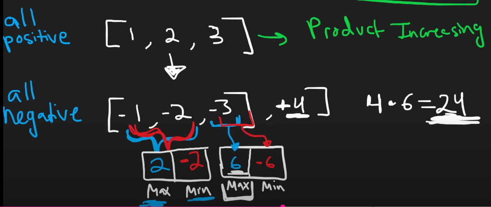

# 152. Maximum Product Subarray

Take a look at the [Kadane's Algorithm](../foundation/misc-algorithms.md#kadanes-algorithm) first and understand how the following line makes sure that a contiguous array's sum is used
 to create `curr_sum`.

```python
curr_sum = max(nums[i], curr_sum+nums[i])
```

Once this is understood, the below lines in the code will make all the sense.

```python
## Similar to Kadane's algo: max(max_prod_from_previous * nums[i] or nums[i])
## Do it for both min and max values from previous, because -ve numbers are present.
curr_max = max(new_curr_max, num * curr_min, num)
curr_min = min(new_curr_max, num * curr_min, num)

## We don't care, -ve, +ve or zero values are present, give me the max!
res = max(res, curr_max)
```

```python
class Solution:
    def maxProduct(self, nums):
        res = nums[0]
        curr_max = 1
        curr_min = 1

        for num in nums:
            new_curr_max = curr_max * num
            curr_max = max(new_curr_max, num * curr_min, num)
            curr_min = min(new_curr_max, num * curr_min, num)
            res = max(res, curr_max)

        return res
```

**Time Complexity:** O(n)

Dry-run some examples to understand how to code works.   
Do it on Kadane's Algorithm first and then run it on this code.




## How Smart is this Algorithm?

#### **"How are we making sure that a contiguous subarray is used to generate the max product?"**

- **By only considering products that end at the current index and are built from previous contiguous products.**
  - Choices are to:
    - Extend the previous subarray (`max_prod * num` or `min_prod * num`).
    - Start a new subarray from the current element (`num` itself).
- **No elements are skipped**, as we don't combine non-adjacent elements.

#### **Handling Negative Numbers and Zero**

- **Negative Numbers:**
  - Can turn a large positive product into a negative, or a large negative product into a positive.
  - Tracking both `max_prod` and `min_prod` ensures we don't miss potential maximums after multiplying negatives.

- **Zeroes:**
  - Reset the product chain.
  - After a zero, the maximum product subarray must start from the next element.
  - The algorithm naturally accommodates this by considering `num` itself in the `max()` and `min()` functions.

#### **Ensuring Correctness**

- **By including `num` in the calculations:**
  - Allows the algorithm to choose starting a new subarray whenever it's advantageous.
- **Products are only from contiguous elements:**
  - **No elements are skipped**, as products are built by sequentially multiplying adjacent elements.

## Examples to Dry-Run

Sure thing! Running through some strategic examples will cement your understanding of how the algorithm handles various cases. Here are some carefully chosen arrays that cover a wide range of scenarios. Each example highlights different aspects of how the algorithm behaves. As you dry-run them, focus on tracking `max_prod`, `min_prod`, and `max_result` at each step.

---

#### **1. All Positive Numbers**

**Example:** `[1, 2, 3, 4]`

**Why it's useful:**

- **Simple Case:** No negative numbers or zeros.
- **What to observe:** The maximum product should be the product of the entire array. Watch how `max_prod` accumulates, and `min_prod` remains less significant.

---

#### **2. All Negative Numbers with Even Count**

**Example:** `[-1, -2, -3, -4]`

**Why it's useful:**

- **Even Negatives Yield Positive Product:** The product of all numbers is positive.
- **What to observe:** How `min_prod` becomes positive after even counts of negatives, impacting `max_result`.

---

#### **3. All Negative Numbers with Odd Count**

**Example:** `[-1, -2, -3]`

**Why it's useful:**

- **Odd Negatives Yield Negative Product:** The overall product is negative.
- **What to observe:** Despite the negative product, individual elements or shorter subarrays might yield a higher product. See how the algorithm handles this.

---

#### **4. Inclusion of Zero**

**Example:** `[0, -2, -3, 0, -4, -1]`

**Why it's useful:**

- **Zeros Reset the Product:** Zeros break the continuity of subarrays.
- **What to observe:** How `max_prod` and `min_prod` reset after zeros. Notice how new subarrays start post-zero.

---

#### **5. Alternating Signs**

**Example:** `[2, -5, -2, -4, 3]`

**Why it's useful:**

- **Sign Changes Affect Products:** Multiple negatives can lead to higher positives.
- **What to observe:** How `max_prod` and `min_prod` swap values. Track how the maximum product emerges in the middle of the array.

---

#### **6. Zero at the Beginning**

**Example:** `[0, -3, 1, -2]`

**Why it's useful:**

- **Starting with Zero:** Tests algorithm initialization.
- **What to observe:** Ensure the algorithm correctly handles zeros at the start and begins new subarrays appropriately.

---

#### **7. Subarray with Maximum Product at the End**

**Example:** `[-2, 0, -1, 0, 4, 5]`

**Why it's useful:**

- **Maximum Product Later in the Array:** Challenges the algorithm to maintain correctness throughout.
- **What to observe:** How the algorithm doesn't miss maximum products that occur after zeros or negative sequences.

---

#### **8. Single Positive and Negatives**

**Example:** `[-2, -3, 7]`

**Why it's useful:**

- **Positive Number After Negatives:** Tests the recovery of `max_prod`.
- **What to observe:** How `max_prod` catches up when a large positive number appears after negatives.

---

#### **9. Large Negative Followed by Positive**

**Example:** `[1, -10, 2, 3]`

**Why it's useful:**

- **Impact of a Large Negative:** Understand how a big negative number affects the ongoing product.
- **What to observe:** Whether the algorithm opts to start anew or continue the existing subarray.

---

#### **10. Multiple Zeros and Negatives**

**Example:** `[-1, 0, -2, 0, -3, 0, -4]`

**Why it's useful:**

- **Complex Interaction of Zeros and Negatives:** Puts the algorithm to the test with frequent resets.
- **What to observe:** How the algorithm navigates frequent zeros and maintains the correct `max_result`.

---

By working through these examples, you'll encounter:

- **The significance of tracking both `max_prod` and `min_prod`.**
- **The impact of zeros resetting the subarray products.**
- **How negative numbers flip the signs and potentially lead to larger products.**
- **Scenarios where starting a new subarray is more beneficial than extending the current one.**

---

**Pro Tip:** As you dry-run, create a table for each example:

| **Index** | **num** | **max_prod** | **min_prod** | **max_result** |
|-----------|---------|--------------|--------------|----------------|
|     0     |         |              |              |                |
|     1     |         |              |              |                |
|   ...     |         |              |              |                |

Filling it out step by step will help you visualize the algorithm's flow and spot patterns in how the variables change.

