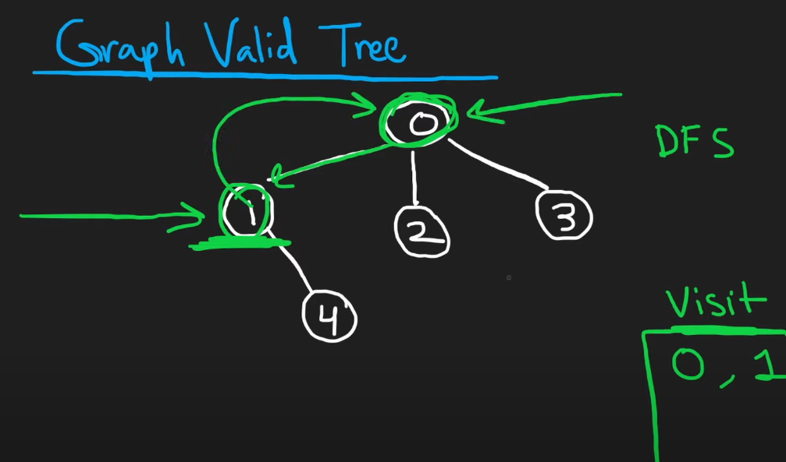

# 261. Graph Valid Tree

Premium Question. Alternate Link: [Graph Valid Tree | Neetcode.io](https://neetcode.io/problems/valid-tree)    

```python
class Solution:
    def validTree(self, n: int, edges: List[List[int]]) -> bool:
        # Create an adjacency list
        adj = {i: [] for i in range(n)}
        for u, v in edges:
            adj[u].append(v)
            adj[v].append(u)

        visited = set()

        def dfs(vertex: int, parent: int) -> bool:
            visited.add(vertex)
            for neighbor in adj[vertex]:
                if neighbor not in visited:
                    if not dfs(neighbor, vertex):
                        return False
                elif neighbor != parent:
                    return False
            return True

        # Check if the graph is connected and acyclic
        if not dfs(0, -1):
            return False

        # Check if all nodes are visited
        return len(visited) == n

# Example usage
solution = Solution()
n = 5
edges = [[0, 1], [0, 2], [0, 3], [1, 4]]

print(solution.validTree(n, edges))  # Output: True
```

Make sure to **not include** the following line in the DFS code out of habit.
We not comparing *node* here, the vertex here is just an integer *representing*
the node itself.    

```python
            def dfs(vertex, parent):
                if not vertex:
                    return True
```
When we do `dfs(0, -1)`, we set `vertex=0` and that causes `if not vertex` 
to be True and results in premature return without exploring the graph.    

---

### Explanation of the approach:
- **Depth-First Search (DFS)**: We use DFS to traverse the graph and check for cycles. By marking nodes as visited and ensuring no node is visited twice (except the parent), we confirm the graph is acyclic.
- **Connectedness**: We check if all nodes are visited by the end of DFS to ensure the graph is connected.
-  **Purpose of Considering Parent:**       
        - **Cycle Detection**: By including the `parent` parameter in the DFS function, we can detect cycles in the graph. If we encounter an already visited node that is not the parent, it indicates a cycle.       
        - **Prevent Backtracking**: The parent node helps prevent the DFS from revisiting the node it just came from, which could falsely indicate a cycle.

In the example below, we started the search from `0` and reached `1`. But `0` is also a neighbour of `1` as `1` was `0`'s neighbour. But if we use the following code then the parent is also added and which would be falsely considered as a **loop**.   
So, we skip parent when it comes as part of the neighbors of its *children*.




### Time & Space Complexity:
- **Time Complexity**: O(V + E), where `V` is the number of vertices and `E` is the number of edges. We visit each vertex and edge once during the traversal.
- **Space Complexity**: O(V), where `V` is the number of vertices. This accounts for the adjacency list and the visited set.

---

## Alternate Solution: Union Find

```python
class Solution:
    def validTree(self, n: int, edges: List[List[int]]) -> bool:
        parent = [i for i in range(n)]

        def find(x):
            while parent[x] != x:
                parent[x] = parent[parent[x]]  # Path compression
                x = parent[x]
            return x

        for u, v in edges:
            pu, pv = find(u), find(v)
            if pu == pv:
                return False  # Cycle detected
            parent[pu] = pv  # Union

        return len(edges) == n - 1
```

**Why Union-Find Works:** Cycle Detection   
If two nodes share the same root parent, connecting them would create a cycle.
The find function identifies the root parent of each node.

More efficient than DFS in large graphs.