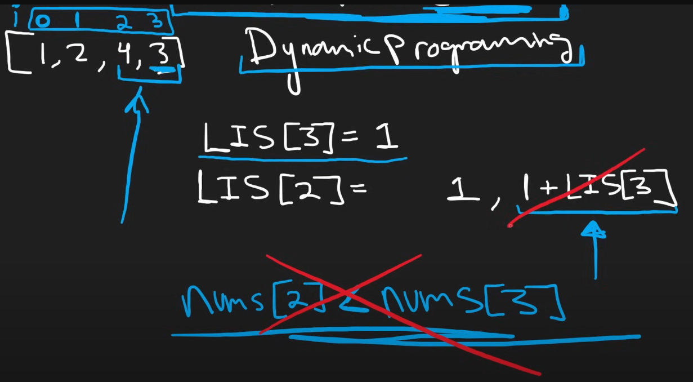

# 300. Longest Increasing Subsequence

## 1. The Brute Force Method (DFS):

```python
def lengthOfLIS(self, nums: List[int]) -> int:
    def dfs(start: int) -> int:
        max_len = 1  # Each element is a subsequence of length 1
        # Explore all valid next elements to extend the subsequence
        for next in range(start + 1, len(nums)):
            if nums[next] > nums[start]:
                max_len = max(max_len, 1 + dfs(next))
        return max_len
    
    if not nums:
        return 0
    # Check all possible starting points and return the maximum
    return max(dfs(i) for i in range(len(nums)))
```

**Time Complexity:** **O(2<sup>n</sup>)**  
- Explanation: In the worst case, the DFS explores all possible subsequences. For each element, there are two choices: either include it in the current subsequence or exclude it. This results in a binary tree of recursive calls with a depth of `n`, leading to exponential time complexity.

## 2. The Brute Force Method with Memoization (Top-Down):

```python
def lengthOfLIS(self, nums: List[int]) -> int:
    n = len(nums)
    if not n:
        return 0
    
    # Dictionary to store cached results
    cache = {}
    
    def dfs(start: int) -> int:
        # Return cached result if available
        if start in cache:
            return cache[start]
        
        max_len = 1
        # Explore all valid next elements to extend the subsequence
        for next in range(start + 1, n):
            if nums[next] > nums[start]:
                max_len = max(max_len, 1 + dfs(next))
        
        # Store the result in cache before returning
        cache[start] = max_len
        return max_len
    
    # Check all possible starting points and return the maximum
    return max(dfs(i) for i in range(n))
```

**Time Complexity:** **O(n<sup>2</sup>)**  
- Explanation:  
  - The memoization ensures that each subproblem (starting at a specific index) is solved only once.  
  - There are `n` unique subproblems (one for each index), and each subproblem takes `O(n)` time to solve (due to the inner loop over the remaining elements).  
  - Thus, the total time complexity is **O(n<sup>2</sup>)**.

## 3. The Dynamic Programming Solution (Bottom-Up):

### Forward Looking Approach

```python
class Solution:
    def lengthOfLIS(self, nums: List[int]) -> int:
        LIS = [1] * len(nums)
        for i in range(len(nums) - 1, -1, -1):  # Iterate backward
            for j in range(i + 1, len(nums)):    # Check future elements
                if nums[i] < nums[j]:
                    LIS[i] = max(LIS[i], 1 + LIS[j])
        return max(LIS)
```

**Key Idea:**
- `LIS[i]` represents the **length of the longest increasing subsequence starting at index `i`**.
- **Direction:** Iterates backward from the end of the array (`i` from `n-1` to `0`).
- **Intuition:** For each `i`, it checks all future indices `j > i` where `nums[j] > nums[i]` and uses the precomputed `LIS[j]` to update `LIS[i]`. This ensures that when processing `i`, all relevant `j > i` values are already computed.

**Example:**
For `nums = [1, 3, 2, 4]`:
- `LIS[3] = 1` (no elements after 4).
- `LIS[2] = 2` (sequence `[2, 4]`).
- `LIS[1] = 2` (sequence `[3, 4]`).
- `LIS[0] = 3` (sequence `[1, 3, 4]` or `[1, 2, 4]`).
- Final result: `max(LIS) = 3`.


### Backward-Looking Approach

```python
def lengthOfLIS(self, nums: List[int]) -> int:
    if not nums:
        return 0
    # dp[i] represents the length of the longest increasing subsequence ending at index i
    dp = [1] * len(nums)
    
    for i in range(len(nums)):
        for j in range(i):
            if nums[j] < nums[i]:
                dp[i] = max(dp[i], dp[j] + 1)  # Update if a longer subsequence is found
    
    return max(dp)
```
**Key Idea:**
- `dp[i]` represents the **length of the longest increasing subsequence ending at index `i`**.
- **Direction:** Iterates forward from the start of the array (`i` from `0` to `n-1`).
- **Intuition:** For each `i`, it checks all past indices `j < i` where `nums[j] < nums[i]` and uses the precomputed `dp[j]` to update `dp[i]`. This builds the solution incrementally by extending valid subsequences.

**Example:**
For `nums = [1, 3, 2, 4]`:
- `dp[0] = 1` (sequence `[1]`).
- `dp[1] = 2` (sequence `[1, 3]`).
- `dp[2] = 2` (sequence `[1, 2]`).
- `dp[3] = 3` (sequence `[1, 3, 4]` or `[1, 2, 4]`).
- Final result: `max(dp) = 3`.


**Time Complexity:** **O(n<sup>2</sup>)**  
- Explanation:  
  - The outer loop runs `n` times, and the inner loop runs up to `n` times for each iteration of the outer loop.  
  - For each element, the algorithm checks all previous elements to update the `dp` array, resulting in a total of **O(n<sup>2</sup>)** operations.

**Key Differences between Forward and Backward Looking Approaches**
| Feature                | First Code (Forward-Looking)               | Second Code (Backward-Looking)         |
|------------------------|--------------------------------------------|----------------------------------------|
| **Subproblem Definition** | `LIS[i]`: Longest subsequence **starting at `i`**. | `dp[i]`: Longest subsequence **ending at `i`**. |
| **Loop Direction**      | Backward iteration (`i` from `n-1` to `0`). | Forward iteration (`i` from `0` to `n-1`). |
| **Dependency**          | Depends on **future values** (`j > i`).    | Depends on **past values** (`j < i`).  |
| **Intuition**           | "What is the best sequence starting here?" | "What is the best sequence ending here?" |


**Approach**




## Summary of Time Complexities:
| Method                          | Time Complexity |
|---------------------------------|-----------------|
| Brute Force (DFS)               | O(2<sup>n</sup>)          |
| Brute Force with Memoization    | O(n<sup>2</sup>)          |
| Dynamic Programming             | O(n<sup>2</sup>)          |
