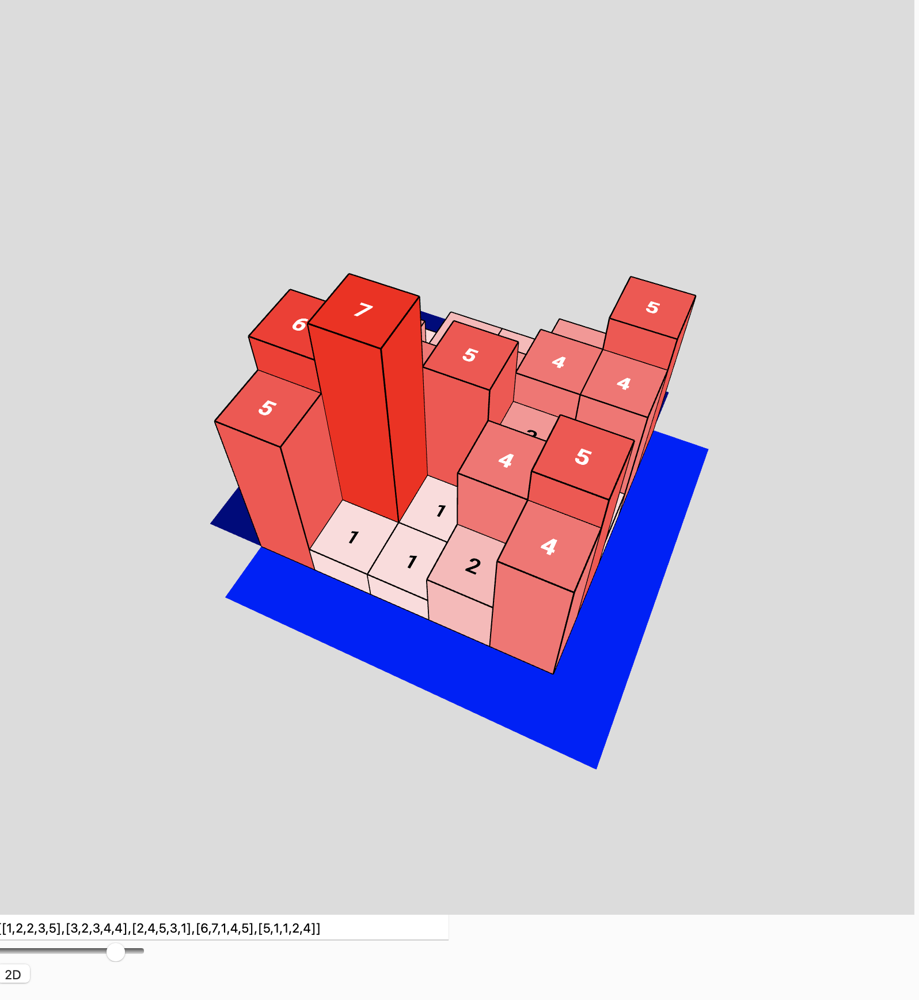

# 417. Pacific Atlantic Water Flow

```python
def pacificAtlantic(heights):
    if not heights or not heights[0]:
        return []

    rows, cols = len(heights), len(heights[0])
    
    def dfs(r, c, visit_set):
        visit_set.add((r, c))
        for dr, dc in ((1, 0), (-1, 0), (0, 1), (0, -1)):
            nr, nc = r + dr, c + dc
            if 0 <= nr < rows and 0 <= nc < cols and (nr, nc) not in visit_set and heights[nr][nc] >= heights[r][c]:
                dfs(nr, nc, visit_set)
    
    pacific = set()
    atlantic = set()
    
    for r in range(rows):
        dfs(r, 0, pacific)
        dfs(r, cols - 1, atlantic)
    for c in range(cols):
        dfs(0, c, pacific)
        dfs(rows - 1, c, atlantic)
    
    return list(pacific & atlantic)

heights = [
    [1, 2, 2, 3, 5],
    [3, 2, 3, 4, 4],
    [2, 4, 5, 3, 1],
    [6, 7, 1, 4, 5],
    [5, 1, 1, 2, 4]
]
print(pacificAtlantic(heights)) 
# Output: [(0, 4), (1, 3), (1, 4), (2, 2), (3, 0), (3, 1), (4, 0)]
```

We are checking `heights[nr][nc] >= heights[r][c]` because we are flowing 
**inwards** from the ocean. So, heights would be compared in reverse order
instead of checking next height as lower or equal.


### Explanation
1. **Approach**: The problem is solved using **Depth-First Search (DFS)** from the edges of the Pacific and Atlantic oceans. By starting DFS from the ocean boundaries and marking cells that can flow into each ocean, we can determine the intersection of the cells that can reach both oceans.
2. **Steps**:
   - Identify the cells adjacent to the Pacific Ocean (left and top edges) and the Atlantic Ocean (right and bottom edges).
   - Perform DFS from these cells, tracking reachable cells for each ocean.
   - The final result is the intersection of cells reachable by both DFS processes.

### Complexity Analysis
- **Time Complexity**: `O(M * N)`, where `M` is the number of rows and `N` is the number of columns. Each cell is processed at most once per ocean.    
- **Space Complexity**: `O(M * N)` for the visited sets used in DFS.




---

## Outward Flow Solution

Absolutely, let's dive into implementing the "outward" flow solution for the Pacific Atlantic Water Flow problem. Instead of having water flow inward from the oceans to the cells (as in your current solution), we'll simulate water flowing outward from each cell towards the oceans.

---

**Conceptual Overview:**

Imagine each cell in the grid as a source of water. Our goal is to determine for each cell whether water can flow from it to **both** the Pacific and Atlantic oceans. Water can only flow from a cell to its neighboring cells if the neighboring cell's height is **less than or equal to** the current cell's height—water can't flow uphill.

---

**Implementation Steps:**

1. **Initialize a Result List:**
   - Create a list to store the coordinates of cells from which water can flow to both oceans.

2. **Define a DFS Function:**
   - The function will attempt to flow water from the current cell to the oceans.
   - Utilize memoization to cache results and avoid redundant calculations.

3. **Iterate Over Each Cell:**
   - For each cell in the grid, perform DFS to check if it can reach both oceans.
   - If it can, add its coordinates to the result list.

---

**Code Implementation:**

Here's how you can implement the "outward" flow solution:

```python
def pacificAtlantic(heights):
    if not heights or not heights[0]:
        return []

    rows, cols = len(heights), len(heights[0])
    result = []
    memo = {}

    def dfs(r, c):
        if (r, c) in memo:
            return memo[(r, c)]

        can_reach_pacific = False
        can_reach_atlantic = False

        if r == 0 or c == 0:
            can_reach_pacific = True
        if r == rows - 1 or c == cols - 1:
            can_reach_atlantic = True

        memo[(r, c)] = [can_reach_pacific, can_reach_atlantic]

        for dr, dc in [(-1, 0), (1, 0), (0, -1), (0, 1)]:
            nr, nc = r + dr, c + dc

            if 0 <= nr < rows and 0 <= nc < cols:
                if heights[nr][nc] <= heights[r][c]:
                    reach_pacific, reach_atlantic = dfs(nr, nc)
                    memo[(r, c)][0] |= reach_pacific
                    memo[(r, c)][1] |= reach_atlantic

                    # Early termination if both oceans are reachable
                    if memo[(r, c)][0] and memo[(r, c)][1]:
                        break

        return memo[(r, c)]

    for r in range(rows):
        for c in range(cols):
            can_reach_pacific, can_reach_atlantic = dfs(r, c)
            if can_reach_pacific and can_reach_atlantic:
                result.append([r, c])

    return result

# Example usage:
heights = [
    [1, 2, 2, 3, 5],
    [3, 2, 3, 4, 4],
    [2, 4, 5, 3, 1],
    [6, 7, 1, 4, 5],
    [5, 1, 1, 2, 4]
]
print(pacificAtlantic(heights))
# Output: [[0, 4], [1, 3], [1, 4], [2, 2], [3, 0], [3, 1], [4, 0]]
```

---

**Explanation:**

- **DFS Function:**
  - The `dfs` function recursively checks if water can flow from the current cell to both oceans.
  - It uses memoization (`memo` dictionary) to store the reachability of each cell, avoiding redundant computations.
  - The function returns a tuple indicating whether the cell can reach the Pacific and Atlantic oceans.

- **Flow Conditions:**
  - Water flows from a cell to its neighboring cells if the neighbor's height is **less than or equal to** the current cell's height.
  - This simulates the "outward" flow of water from higher elevations to lower or equal elevations.

- **Base Cases:**
  - If a cell is on the top or left edge, it can reach the **Pacific Ocean**.
  - If a cell is on the bottom or right edge, it can reach the **Atlantic Ocean**.

- **Early Termination:**
  - If both oceans are reachable from a cell, we break early from the loop to optimize performance.

---

**Performance Analysis:**

- **Time Complexity:** The outward flow solution has a time complexity of roughly \( O((m \times n)^2) \) because we perform DFS from every cell, and each DFS can potentially visit every cell in the grid.
- **Space Complexity:** The space complexity is \( O(m \times n) \) due to the memoization dictionary.

**Comparison with Inward Flow Solution:**

- The inward flow solution is more efficient with a time complexity of \( O(m \times n) \) because it starts DFS from the ocean borders and moves inward, reducing the number of searches.
- The outward flow solution is computationally intensive due to redundant traversals, especially for larger grids.

---

**Visualizing the Concept:**

Think of each cell as a tiny spring releasing water. The water can only flow downhill or on flat terrain—not uphill. Our mission is to find all springs from which water can reach **both** the Pacific and Atlantic oceans.

Here's an ASCII representation:

```
    Pacific Ocean
    ~~~~~~~~~~~~~
  P |   ↑ ↑ ↑ ↑ ↑   A
  A | ← 1 2 2 3 5 → T
  C | ← 3 2 3 4 4 → L
  I | ← 2 4 5 3 1 → A
  F | ← 6 7 1 4 5 → N
  I | ← 5 1 1 2 4 → T
  C |   ↓ ↓ ↓ ↓ ↓   I
    ~~~~~~~~~~~~~   C
    Atlantic Ocean
```

- Arrows indicate the potential flow directions.
- Water flows from higher to lower or equal heights.
- We check if from a cell, water can reach both the top/left edges (Pacific) and the bottom/right edges (Atlantic).

---

**Why Consider the Outward Flow Solution?**

- **Educational Value:** Implementing the outward flow solution enhances understanding of graph traversal algorithms and the importance of optimization.
- **Dynamic Programming Practice:** It provides an opportunity to apply memoization techniques to reduce redundant computations.

---

**Optimizing the Outward Flow Solution:**

To improve efficiency:

- **Prune Unnecessary Paths:** Utilize early termination when both oceans are reachable from a cell.
- **Sequential Processing:** Potentially process cells in an order that maximizes the chances of early termination.

---

**Alternative Approach with BFS:**

You can modify the solution to use Breadth-First Search (BFS) instead of DFS:

```python
from collections import deque

def pacificAtlantic(heights):
    if not heights or not heights[0]:
        return []

    rows, cols = len(heights), len(heights[0])
    result = []
    memo = {}

    def bfs(r, c):
        queue = deque()
        queue.append((r, c))
        visited = set()
        can_reach_pacific = False
        can_reach_atlantic = False

        while queue:
            cr, cc = queue.popleft()
            if (cr, cc) in visited:
                continue
            visited.add((cr, cc))

            if cr == 0 or cc == 0:
                can_reach_pacific = True
            if cr == rows - 1 or cc == cols - 1:
                can_reach_atlantic = True
            if can_reach_pacific and can_reach_atlantic:
                break

            for dr, dc in [(-1, 0), (1, 0), (0, -1), (0, 1)]:
                nr, nc = cr + dr, cc + dc
                if 0 <= nr < rows and 0 <= nc < cols:
                    if heights[nr][nc] <= heights[cr][cc]:
                        queue.append((nr, nc))

        return can_reach_pacific and can_reach_atlantic

    for r in range(rows):
        for c in range(cols):
            if bfs(r, c):
                result.append([r, c])

    return result
```

- **Note:** This BFS approach may still suffer from performance issues on large grids due to its inherent time complexity.

---

**Takeaways:**

- The outward flow solution, while conceptually straightforward, is not optimal for this problem.
- The inward flow solution leverages the problem's properties to provide an efficient and elegant solution.
- Understanding both approaches enriches your grasp of algorithm design and optimization.
